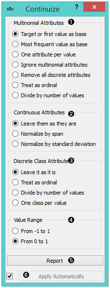
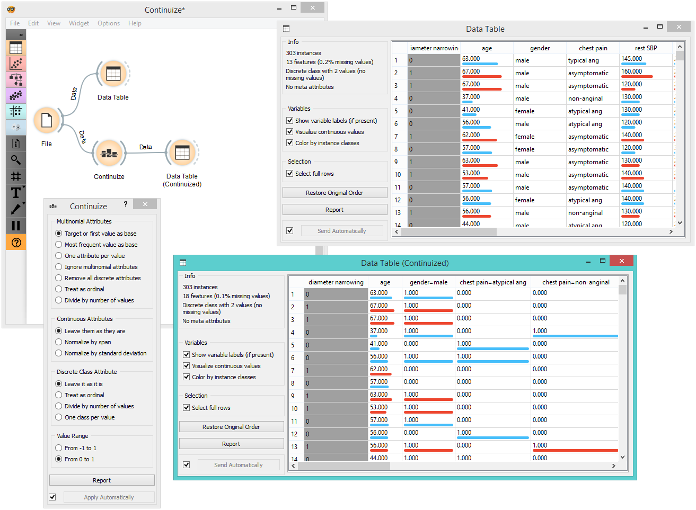
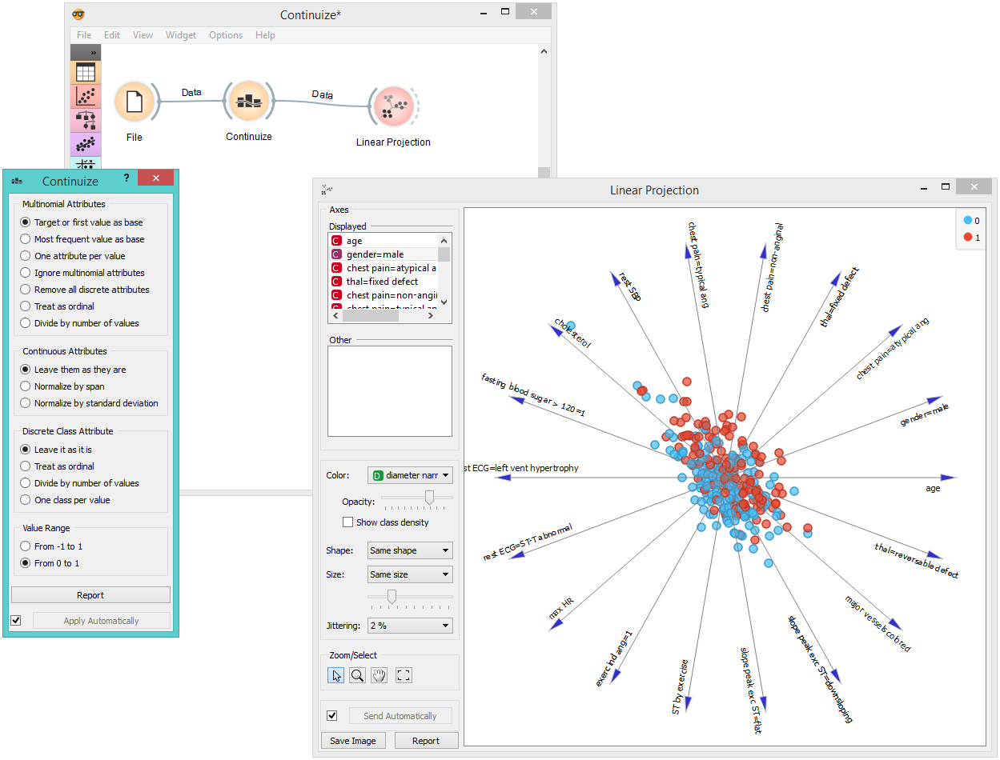

Continuize
==========

Turns discrete variables (attributes) into numeric ("continuous") dummy variables.

**Inputs**

- Data: input data set

**Outputs**

- Data: transformed data set

The **Continuize** widget receives a data set in the input and outputs the same data set in which the discrete variables (including binary variables) are replaced with continuous ones.

1. Define the treatment of non-binary categorical variables.

    Examples in this section will assume that we have a discrete attribute status with the values low, middle and high, listed in that order. Options for their transformation are:

   - **First value as base**: a N-valued categorical variable will be transformed into N-1 numeric variables, each serving as an indicator for one of the original values except for the base value. The base value is the first value in the list. By default, the values are ordered alphabetically; their order can be changed in [Edit Domain](../data/editdomain).

       In the above case, the three-valued variable *status* is transformed into two numeric variables, *status=middle* with values 0 or 1 indicating whether the original variable had value *middle* on a particular example, and similarly, *status=high*.

   - **Most frequent value as base**: similar to the above, except that the most frequent value is used as a base. So, if the most frequent value in the above example is *middle*, then *middle* is considered as the base and the two newly constructed variables are *status=low* and *status=high*.

   - **One attribute per value**: this option constructs one numeric variable per each value of the original variable. In the above case, we would get variables *status=low*, *status=middle* and *status=high*.

   - **Ignore multinomial attributes**: removes non-binary categorical variables from the data.

   - **Treat as ordinal**: converts the variable into a single numeric variable enumerating the original values. In the above case, the new variable would have the value of 0 for *low*, 1 for *middle* and 2 for *high*. Again note that the order of values can be set in  [Edit Domain](../data/editdomain).

   - **Divide by number of values**: same as above, except that values are normalized into range 0-1. In our example, the values of the new variable would be 0, 0.5 and 1.

2. Define the treatment of continuous attributes. Besised the option to *Leave them as they are*, we can *Normalize by span*, which will subtract the lowest value found in the data and divide by the span, so all values will fit into [0, 1]. Option *Normalize by standard deviation* subtracts the average and divides by the standard deviation.

3. Define the treatment of class attributes (outcomes, targets). Besides leaving it as it is, the available options mirror those for multinomial attributes, except for those that would split the outcome into multiple outcome variables.

4. This option defines the ranges of new variables. In the above text, we supposed the range *from 0 to 1*.

5. Produce a report.

6. If *Apply automatically* is ticked, changes are committed automatically. Otherwise, you have to press *Apply* after each change.

Examples
--------

First, let's see what is the output of the **Continuize** widget. We feed the original data (the *Heart disease* data set) into the [Data Table](../data/datatable) and see how they look like. Then we continuize the discrete values and observe them in another [Data Table](../data/datatable).

In the second example, we show a typical use of this widget - in order to properly plot the linear projection of the data, discrete attributes need to be converted to continuous ones and that is why we put the data through the **Continuize** widget before drawing it. The attribute "*chest pain*" originally had four values and was transformed into three continuous attributes; similar happened to gender, which was transformed into a single attribute "*gender=female*".

