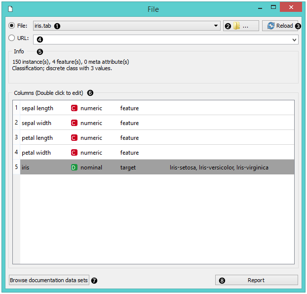
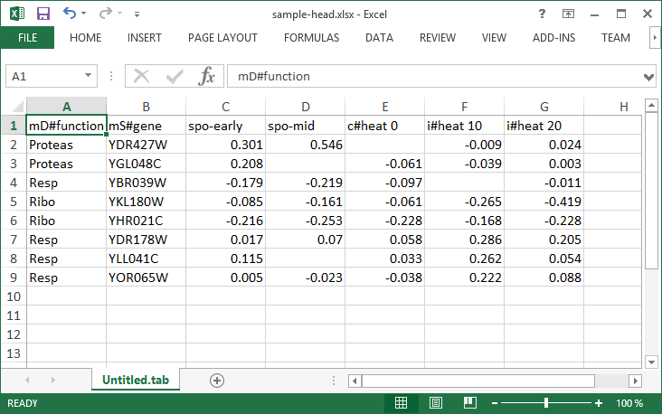

File
====

Reads attribute-value data from an input file.

**Outputs**

- Data: dataset from the file

The **File** widget [reads the input data file](../../loading-your-data/index.md) (data table with data instances) and sends the dataset to its output channel. The history of most recently opened files is maintained in the widget. The widget also includes a directory with sample datasets that come pre-installed with Orange.

The widget reads data from Excel (**.xlsx**), simple tab-delimited (**.txt**), comma-separated files (**.csv**) or URLs. For other formats see Other Formats section below.

1. Browse through previously opened data files, or load any of the sample ones.  
2. Browse for a data file.
3. Reloads currently selected data file.
4. Insert data from URL addresses, including data from Google Sheets.
5. Information on the loaded dataset: dataset size, number and types of data features.
6. Additional information on the features in the dataset. Features can be edited by double-clicking on them. The user can change the attribute names, select the type of variable per each attribute (*Continuous*, *Nominal*, *String*, *Datetime*), and choose how to further define the attributes (as *Features*, *Targets* or *Meta*). The user can also decide to ignore an attribute.
7. Browse documentation datasets.
8. Produce a report.

Example
-------

Most Orange workflows would probably start with the **File** widget. In the schema below, the widget is used to read the data that is sent to both the [Data Table](../data/datatable.md) and the [Box Plot](../visualize/boxplot.md) widget.

### Loading your data

- Orange can import any comma, .xlsx or tab-delimited data file or URL. Use the **File** widget and then, if needed, select class and meta attributes.
- To specify the domain and the type of the attribute, attribute names can be preceded with a label followed by a hash. Use c for class and m for meta attribute, i to ignore a column, and C, D, S for continuous, discrete and string attribute types. Examples: C#mpg, mS#name, i#dummy.
- Orange's native format is a tab-delimited text file with three header rows. The first row contains attribute names, the second the type (*continuous*, *discrete* or *string*), and the third the optional element (*class*, *meta* or *time*).

Read more on loading your data [here](../../loading-your-data/index.md).

### Other Formats

Supported formats and the widgets to load them:

- distance matrix: [Distance File](../unsupervised/distancefile.md)
- predictive model: [Load Model](../model/loadmodel.md)
- network: Network File from Network add-on
- images: Import Images from Image Analytics add-on
- text/corpus: Corpus or Import Documents from Text add-on
- single cell data: Load Data from Single Cell add-on
- several spectroscopy files: Multifile from Spectroscopy add-on
