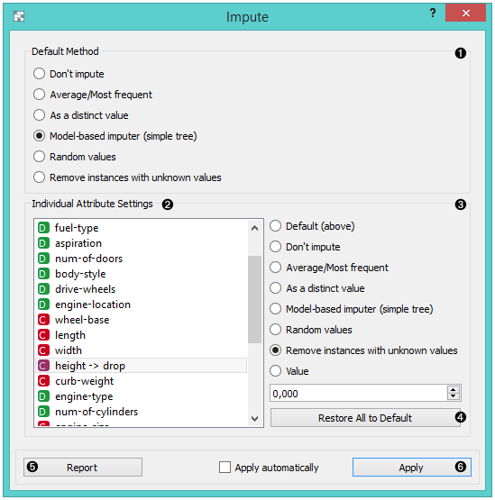
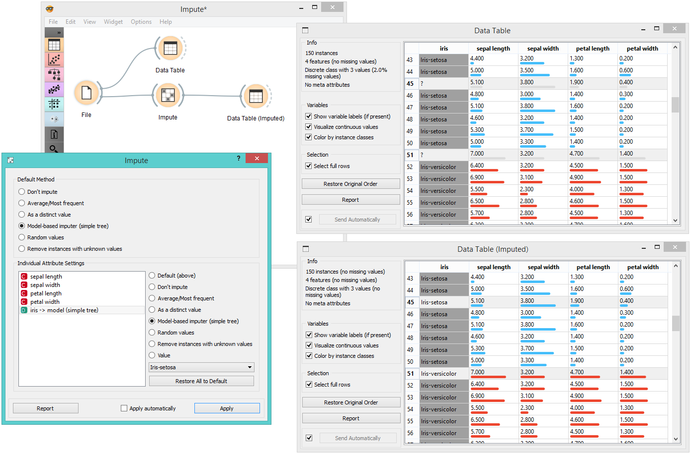

Impute
======

Replaces unknown values in the data.

**Inputs**

- Data: input dataset
- Learner: learning algorithm for imputation

**Outputs**

- Data: dataset with imputed values

Some Orange's algorithms and visualizations cannot handle unknown values in the data. This widget does what statisticians call imputation: it substitutes missing values by values either computed from the data or set by the user. The default imputation is (1-NN).

1. In the top-most box, *Default method*, the user can specify a general imputation technique for all attributes.
   - **Don't Impute** does nothing with the missing values.
   - **Average/Most-frequent** uses the average value (for continuous attributes) or the most common value (for discrete attributes).
   - **As a distinct value** creates new values to substitute the missing ones.
   - **Model-based imputer** constructs a model for predicting the missing value, based on values of other attributes; a separate model is constructed for each attribute. The default model is 1-NN learner, which takes the value from the most similar example (this is sometimes referred to as hot deck imputation). This algorithm can be substituted by one that the user connects to the input signal Learner for Imputation. Note, however, that if there are discrete and continuous attributes in the data, the algorithm needs to be capable of handling them both; at the moment only 1-NN learner can do that. (In the future, when Orange has more regressors, the Impute widget may have separate input signals for discrete and continuous models.)
   - **Random values** computes the distributions of values for each attribute and then imputes by picking random values from them.
   - **Remove examples with missing values** removes the example containing missing values. This check also applies to the class attribute if *Impute class values* is checked.

2. It is possible to specify individual treatment for each attribute, which overrides the default treatment set. One can also specify a manually defined value used for imputation. In the screenshot, we decided not to impute the values of "*normalized-losses*" and "*make*", the missing values of "*aspiration*" will be replaced by random values, while the missing values of "*body-style*" and "*drive-wheels*" are replaced by "*hatchback*" and "*fwd*",respectively. If the values of "*length*", "*width*" or "*height*" are missing, the example is discarded. Values of all other attributes use the default method set above (model-based imputer, in our case).
3. The imputation methods for individual attributes are the same as default methods.
4. *Restore All to Default* resets the individual attribute treatments to default.
5. Produce a report.
6. All changes are committed immediately if *Apply automatically* is checked. Otherwise, *Apply* needs to be ticked to apply any new settings.

Example
-------

To demonstrate how the **Impute** widget works, we played around with the *Iris* dataset and deleted some of the data. We used the **Impute** widget and selected the *Model-based imputer* to impute the missing values. In another [Data Table](../data/datatable.md), we see how the question marks turned into distinct values ("Iris-setosa, "Iris-versicolor").

