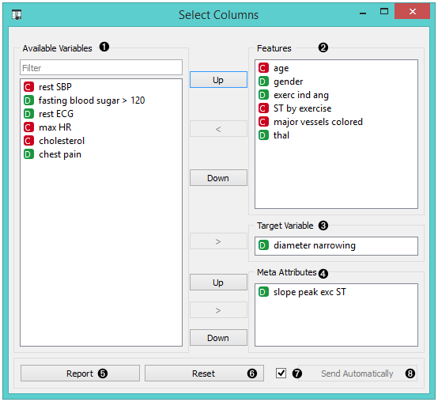
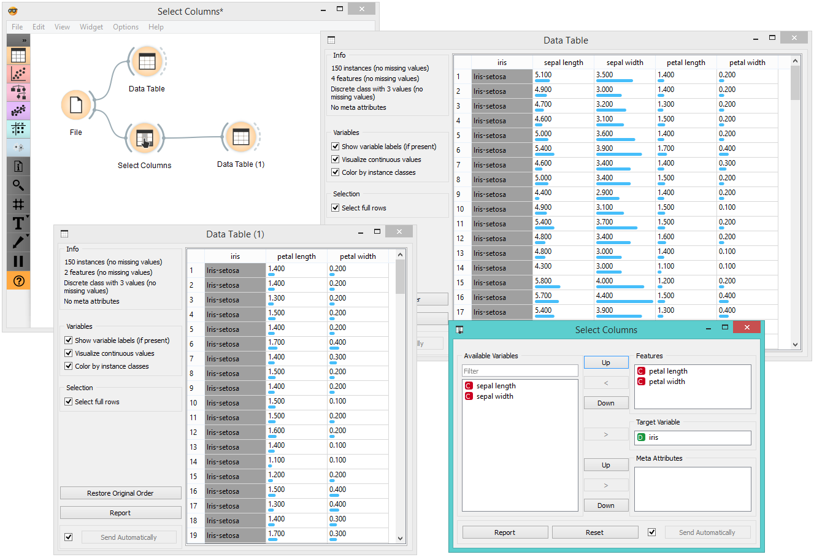
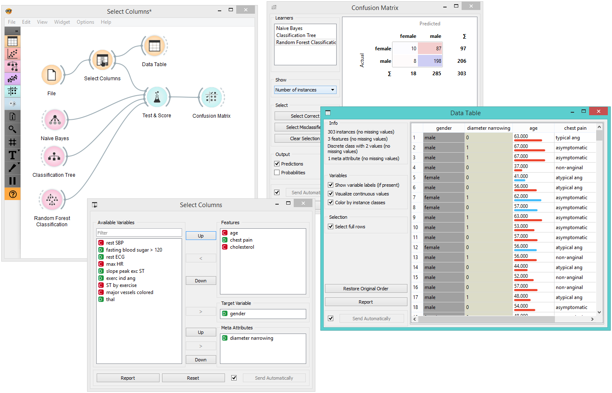

Select Columns
==============

Manual selection of data attributes and composition of data domain.

**Inputs**

- Data: input dataset

**Outputs**

- Data: dataset with columns as set in the widget

The **Select Columns** widget is used to manually compose your [data domain](https://en.wikipedia.org/wiki/Data_domain). The user can decide which attributes will be used and how. Orange distinguishes between ordinary attributes, (optional) class attributes and meta attributes. For instance, for building a classification model, the domain would be composed of a set of attributes and a discrete class attribute. Meta attributes are not used in modeling, but several widgets can use them as instance labels.

Orange attributes have a type and are either discrete, continuous or a character string. The attribute type is marked with a symbol appearing before the name of the attribute (D, C, S, respectively).

1. Left-out data attributes that will not be in the output data file
2. Data attributes in the new data file
3. Target variable. If none, the new dataset will be without a target variable.
4. Meta attributes of the new data file. These attributes are included in the dataset but are, for most methods, not considered in the analysis.
5. Produce a report.
6. Reset the domain composition to that of the input data file.
7. Tick if you wish to auto-apply changes of the data domain. 
8. Apply changes of the data domain and send the new data file to the output channel of the widget.

Examples
--------

In the workflow below, the *Iris* data from the [File](../data/file.md) widget is fed into the **Select Columns** widget, where we select to output only two attributes (namely petal width and petal length). We view both the original dataset and the dataset with selected columns in the [Data Table](../data/datatable.md) widget.

For a more complex use of the widget, we composed a workflow to redefine the classification problem in the *heart-disease* dataset. Originally, the task was to predict if the patient has a coronary artery diameter narrowing. We changed the problem to that of gender classification, based on age, chest pain and cholesterol level, and informatively kept the diameter narrowing as a meta attribute.

