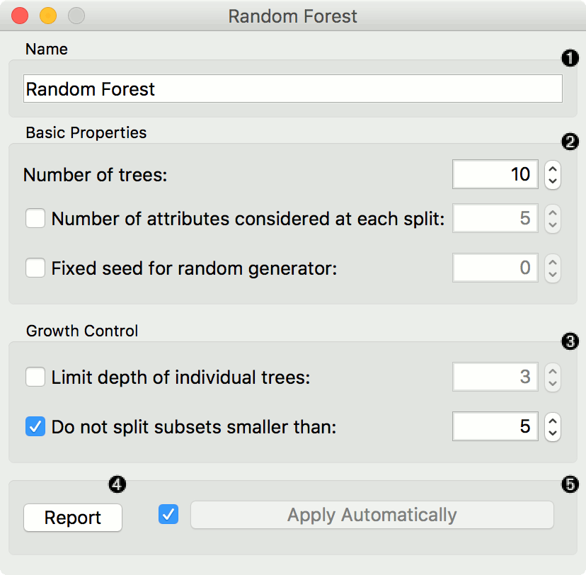
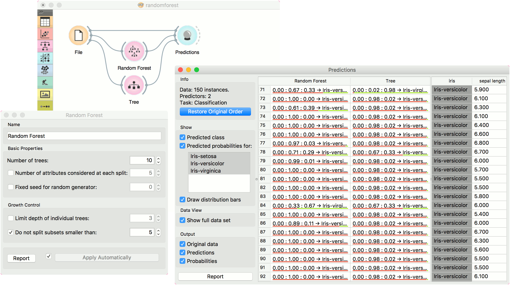
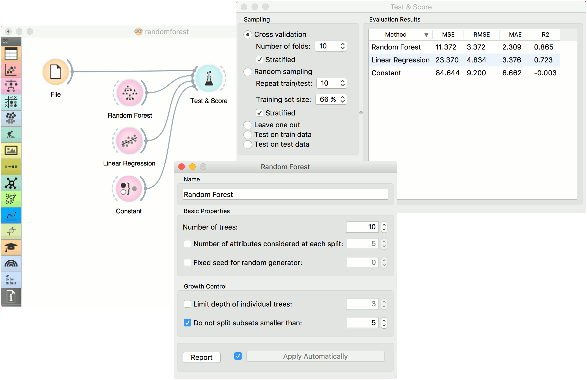

Random Forest
=============

Predict using an ensemble of decision trees.

**Inputs**

- Data: input dataset
- Preprocessor: preprocessing method(s)

**Outputs**

- Learner: random forest learning algorithm
- Model: trained model

[Random forest](https://en.wikipedia.org/wiki/Random_forest) is an ensemble learning method used for classification, regression and other tasks. It was first proposed by Tin Kam Ho and further developed by Leo Breiman (Breiman, 2001) and Adele Cutler.

**Random Forest** builds a set of decision trees. Each tree is developed from a bootstrap sample from the training data. When developing individual trees, an arbitrary subset of attributes is drawn (hence the term "Random"), from which the best attribute for the split is selected. The final model is based on the majority vote from individually developed trees in the forest.

**Random Forest** works for both classification and regression tasks.

1. Specify the name of the model. The default name is "Random Forest".
2. Specify how many decision trees will be included in the forest (*Number of trees in the forest*), and how many attributes will be arbitrarily drawn for consideration at each node. If the latter is not specified (option *Number of attributes...* left unchecked), this number is equal to the square root of the number of attributes in the data. You can also choose to fix the seed for tree generation (*Fixed seed for random generator*), which enables replicability of the results.
3. Original Breiman's proposal is to grow the trees without any pre-pruning, but since pre-pruning often works quite well and is faster, the user can set the depth to which the trees will be grown (*Limit depth of individual trees*). Another pre-pruning option is to select the smallest subset that can be split (*Do not split subsets smaller than*).
4. Produce a report.
5. Click *Apply* to communicate the changes to other widgets. Alternatively, tick the box on the left side of the *Apply* button and changes will be communicated automatically.

Examples
--------

For classification tasks, we use *iris* dataset. Connect it to [Predictions](../evaluate/predictions.md). Then, connect [File](../data/file.md) to **Random Forest** and [Tree](../model/tree.md) and connect them further to [Predictions](../evaluate/predictions.md). Finally, observe the predictions for the two models.

For regressions tasks, we will use *housing* data. Here, we will compare different models, namely **Random Forest**, [Linear Regression](../model/linearregression.md) and [Constant](../model/constant.md), in the [Test & Score](../evaluate/testandscore.md) widget.

References
----------

Breiman, L. (2001). Random Forests. In Machine Learning, 45(1), 5-32. Available [here](https://www.stat.berkeley.edu/~breiman/randomforest2001.pdf).
