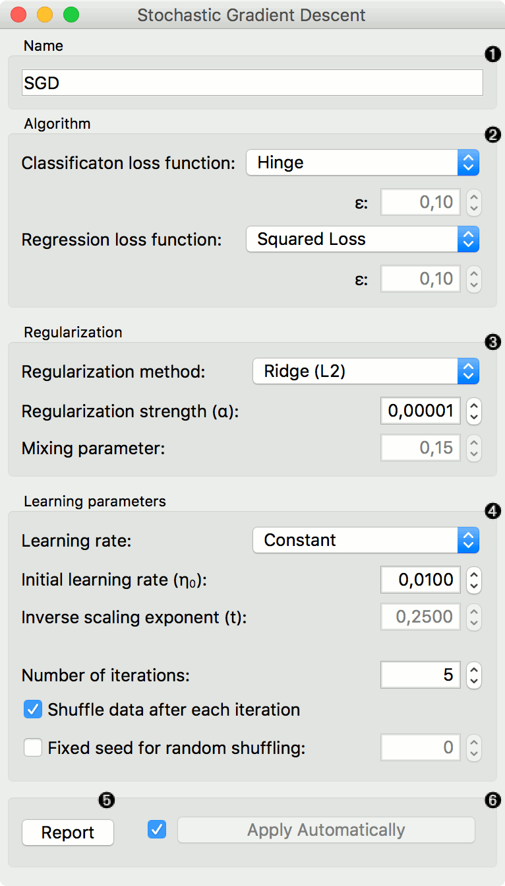
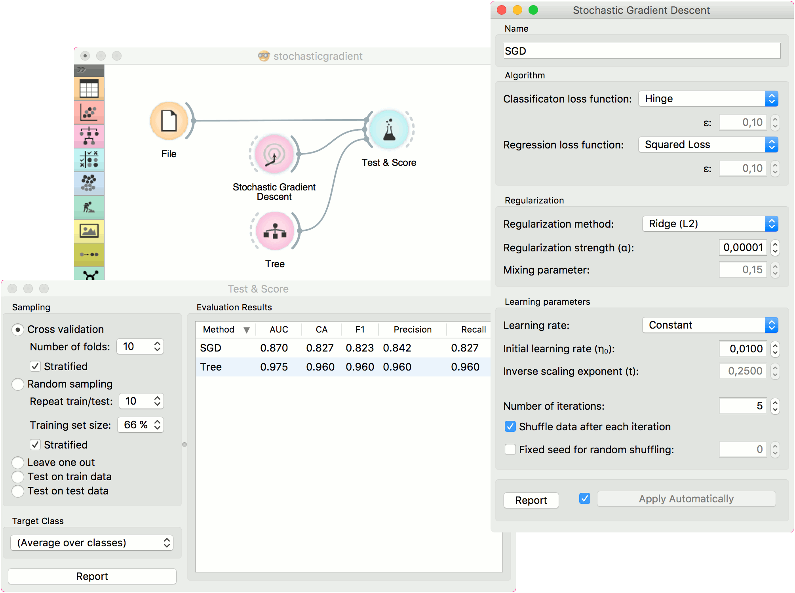
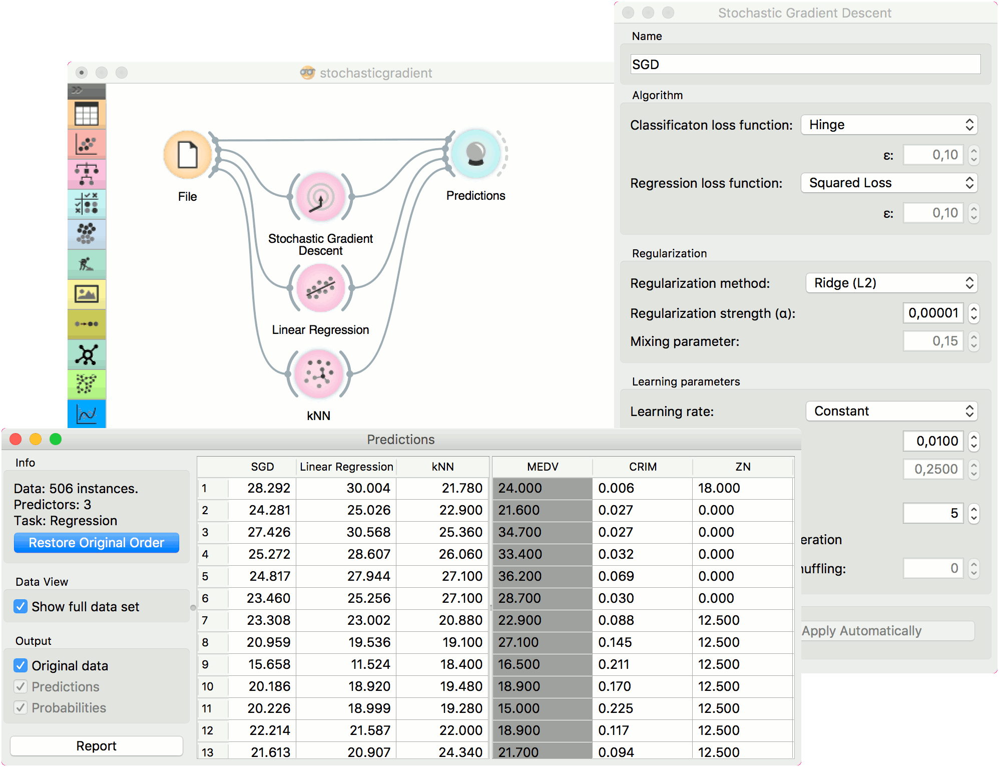

Stochastic Gradient Descent
===========================

Minimize an objective function using a stochastic approximation of gradient descent.

**Inputs**

- Data: input dataset
- Preprocessor: preprocessing method(s)

**Outputs**

- Learner: stochastic gradient descent learning algorithm
- Model: trained model

The **Stochastic Gradient Descent** widget uses [stochastic gradient descent](https://en.wikipedia.org/wiki/Stochastic_gradient_descent) that minimizes a chosen loss function with a linear function. The algorithm approximates a true gradient by considering one sample at a time, and simultaneously updates the model based on the gradient of the loss function. For regression, it returns predictors as minimizers of the sum, i.e. M-estimators, and is especially useful for large-scale and sparse datasets.

1. Specify the name of the model. The default name is "SGD".
2. Algorithm parameters:
    - Classification loss function:
        - [Hinge](https://en.wikipedia.org/wiki/Hinge_loss) (linear SVM)
        - [Logistic Regression](http://scikit-learn.org/stable/modules/generated/sklearn.linear_model.LogisticRegression.html#sklearn.linear_model.LogisticRegression) (logistic regression SGD)
        - [Modified Huber](https://en.wikipedia.org/wiki/Huber_loss) (smooth loss that brings tolerance to outliers as well as probability estimates)
        - *Squared Hinge* (quadratically penalized hinge)
        - [Perceptron](http://scikit-learn.org/stable/modules/generated/sklearn.linear_model.Perceptron.html#sklearn.linear_model.Perceptron) (linear loss used by the perceptron algorithm)
        - [Squared Loss](https://en.wikipedia.org/wiki/Mean_squared_error#Regression) (fitted to ordinary least-squares)
        - [Huber](https://en.wikipedia.org/wiki/Huber_loss) (switches to linear loss beyond ε)
        - [Epsilon insensitive](http://kernelsvm.tripod.com/) (ignores errors within ε, linear beyond it)
        - *Squared epsilon insensitive* (loss is squared beyond ε-region).
    - Regression loss function:
        - [Squared Loss](https://en.wikipedia.org/wiki/Mean_squared_error#Regression) (fitted to ordinary least-squares)
        - [Huber](https://en.wikipedia.org/wiki/Huber_loss) (switches to linear loss beyond ε)
        - [Epsilon insensitive](http://kernelsvm.tripod.com/) (ignores errors within ε, linear beyond it)
        - *Squared epsilon insensitive* (loss is squared beyond ε-region).
3. Regularization norms to prevent overfitting:
   - None.
   - [Lasso (L1)](https://en.wikipedia.org/wiki/Taxicab_geometry) (L1 leading to sparse solutions)
   - [Ridge (L2)](https://en.wikipedia.org/wiki/Norm_(mathematics)#p-norm) (L2, standard regularizer)
   - [Elastic net](https://en.wikipedia.org/wiki/Elastic_net_regularization) (mixing both penalty norms).

   Regularization strength defines how much regularization will be applied (the less we regularize, the more we allow the model to fit the data) and the mixing parameter what the ratio between L1 and L2 loss will be (if set to 0 then the loss is L2, if set to 1 then it is L1).
4. Learning parameters.
   - Learning rate:
      - *Constant*: learning rate stays the same through all epochs (passes)
      - [Optimal](http://leon.bottou.org/projects/sgd): a heuristic proposed by Leon Bottou
      - [Inverse scaling](http://users.ics.aalto.fi/jhollmen/dippa/node22.html): earning rate is inversely related to the number of iterations
   - Initial learning rate.
   - Inverse scaling exponent: learning rate decay.
   - Number of iterations: the number of passes through the training data.
   - If *Shuffle data after each iteration* is on, the order of data instances is mixed after each pass.
   - If *Fixed seed for random shuffling* is on, the algorithm will use a fixed random seed and enable replicating the results.
5. Produce a report.
6. Press *Apply* to commit changes. Alternatively, tick the box on the left side of the *Apply* button and changes will be communicated automatically.

Examples
--------

For the classification task, we will use *iris* dataset and test two models on it. We connected [Stochastic Gradient Descent](../model/stochasticgradient.md) and [Tree](../model/tree.md) to [Test & Score](../evaluate/testandscore.md). We also connected [File](../data/file.md) to **Test & Score** and observed model performance in the widget.

For the regression task, we will compare three different models to see which predict what kind of results. For the purpose of this example, the *housing* dataset is used. We connect the [File](../data/file.md) widget to **Stochastic Gradient Descent**, [Linear Regression](../model/linearregression.md) and [kNN](../model/knn.md) widget and all four to the [Predictions](../evaluate/predictions.md) widget.

