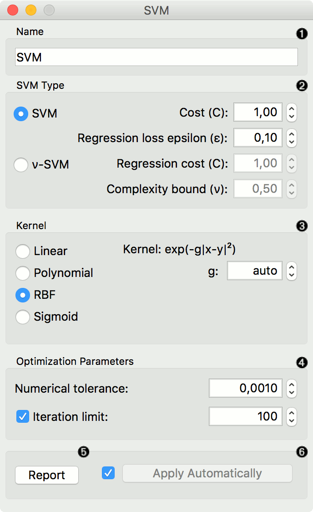
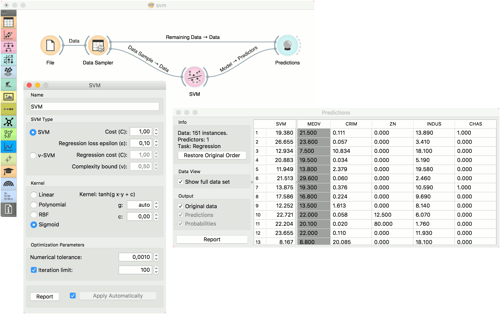
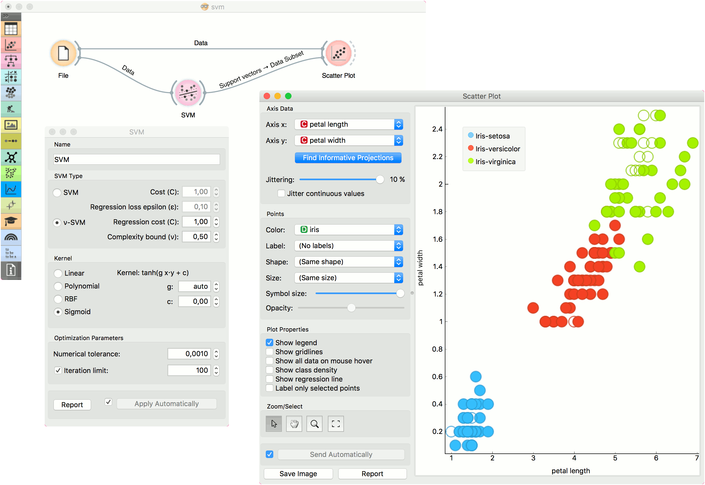

SVM
===

Support Vector Machines map inputs to higher-dimensional feature spaces.

**Inputs**

- Data: input dataset
- Preprocessor: preprocessing method(s)

**Outputs**

- Learner: linear regression learning algorithm
- Model: trained model
- Support Vectors: instances used as support vectors

[Support vector machine](https://en.wikipedia.org/wiki/Support_vector_machine) (SVM) is a machine learning technique that separates the attribute space with a hyperplane, thus maximizing the margin between the instances of different classes or class values. The technique often yields supreme predictive performance results. Orange embeds a popular implementation of SVM from the [LIBSVM](https://www.csie.ntu.edu.tw/~cjlin/libsvm/) package. This widget is its graphical user interface.

For regression tasks, **SVM** performs linear regression in a high dimension feature space using an ε-insensitive loss. Its estimation accuracy depends on a good setting of C, ε and kernel parameters. The widget outputs class predictions based on a [SVM Regression](https://en.wikipedia.org/wiki/Support_vector_machine#Regression).

The widget works for both classification and regression tasks.

1. The learner can be given a name under which it will appear in other widgets. The default name is "SVM".
2. SVM type with test error settings. *SVM* and *ν-SVM* are based on different minimization of the error function. On the right side, you can set test error bounds:
   - [SVM](http://scikit-learn.org/stable/modules/generated/sklearn.svm.SVR.html):
      - [Cost](http://www.quora.com/What-are-C-and-gamma-with-regards-to-a-support-vector-machine): penalty term for loss and applies for classification and regression tasks.
      - ε: a parameter to the epsilon-SVR model, applies to regression tasks. Defines the distance from true values within which no penalty is associated with predicted values.
   - [ν-SVM](http://scikit-learn.org/stable/modules/generated/sklearn.svm.NuSVR.html#sklearn.svm.NuSVR):
      - [Cost](http://www.quora.com/What-are-C-and-gamma-with-regards-to-a-support-vector-machine): penalty term for loss and applies only to regression tasks
      - ν: a parameter to the ν-SVR model, applies to classification and regression tasks. An upper bound on the fraction of training errors and a lower bound of the fraction of support vectors.
3. Kernel is a function that transforms attribute space to a new feature space to fit the maximum-margin hyperplane, thus allowing the algorithm to create the model with [Linear](https://en.wikipedia.org/wiki/Linear_model), [Polynomial](https://en.wikipedia.org/wiki/Polynomial_kernel), [RBF](https://en.wikipedia.org/wiki/Radial_basis_function_kernel) and [Sigmoid](http://crsouza.com/2010/03/kernel-functions-for-machine-learning-applications/#sigmoid) kernels. Functions that specify the kernel are presented upon selecting them, and the constants involved are:
   - **g** for the gamma constant in kernel function (the recommended value is 1/k, where k is the number of the attributes, but since there may be no training set given to the widget the default is 0 and the user has to set this option manually),
   - **c** for the constant c0 in the kernel function (default 0), and
   - **d** for the degree of the kernel (default 3).
4. Set permitted deviation from the expected value in *Numerical Tolerance*. Tick the box next to *Iteration Limit* to set the maximum number of iterations permitted.
5. Produce a report.
6. Click *Apply* to commit changes. If you tick the box on the left side of the *Apply* button, changes will be communicated automatically.

Examples
--------

In the first (regression) example, we have used *housing* dataset and split the data into two data subsets (*Data Sample* and *Remaining Data*) with [Data Sampler](../data/datasampler.md). The sample was sent to SVM which produced a *Model*, which was then used in [Predictions](../evaluate/predictions.md) to predict the values in *Remaining Data*. A similar schema can be used if the data is already in two separate files; in this case, two [File](../data/file.md) widgets would be used instead of the [File](../data/file.md) - [Data Sampler](../data/datasampler.md) combination.

The second example shows how to use **SVM** in combination with [Scatter Plot](../visualize/scatterplot.md). The following workflow trains a SVM model on *iris* data and outputs support vectors, which are those data instances that were used as support vectors in the learning phase. We can observe which are these data instances in a scatter plot visualization. Note that for the workflow to work correctly, you must set the links between widgets as demonstrated in the screenshot below.

References
----------

[Introduction to SVM on StatSoft](http://www.statsoft.com/Textbook/Support-Vector-Machines).
