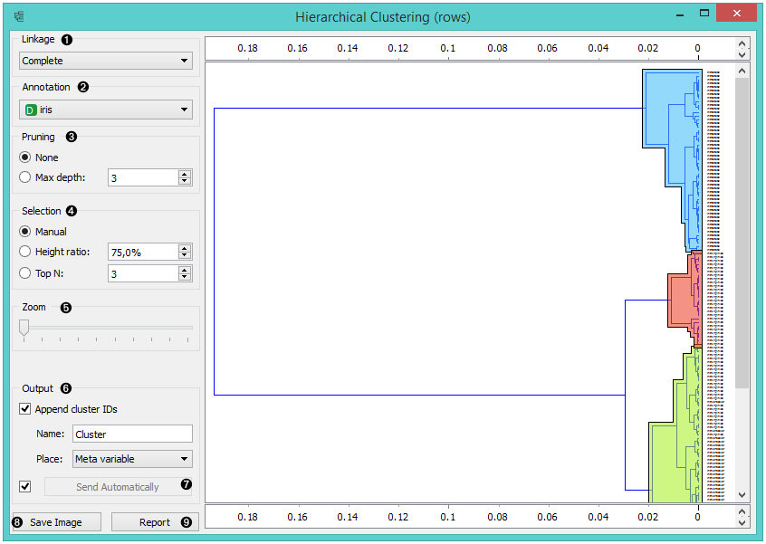
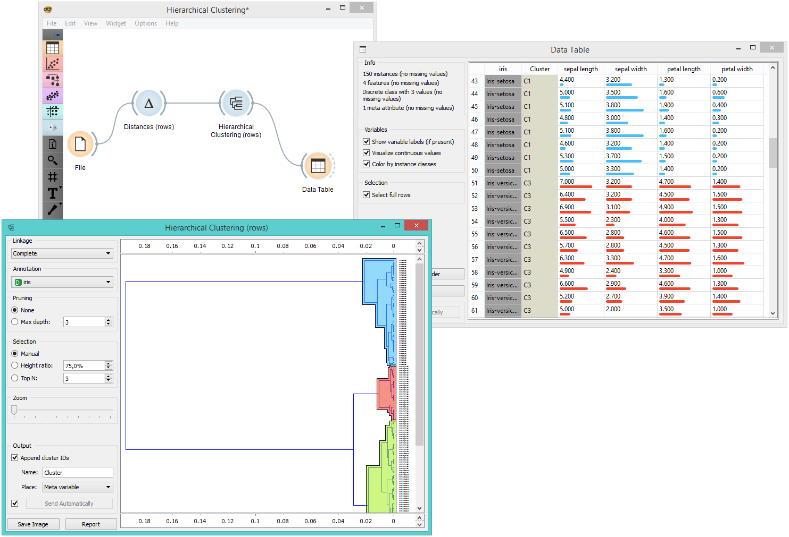
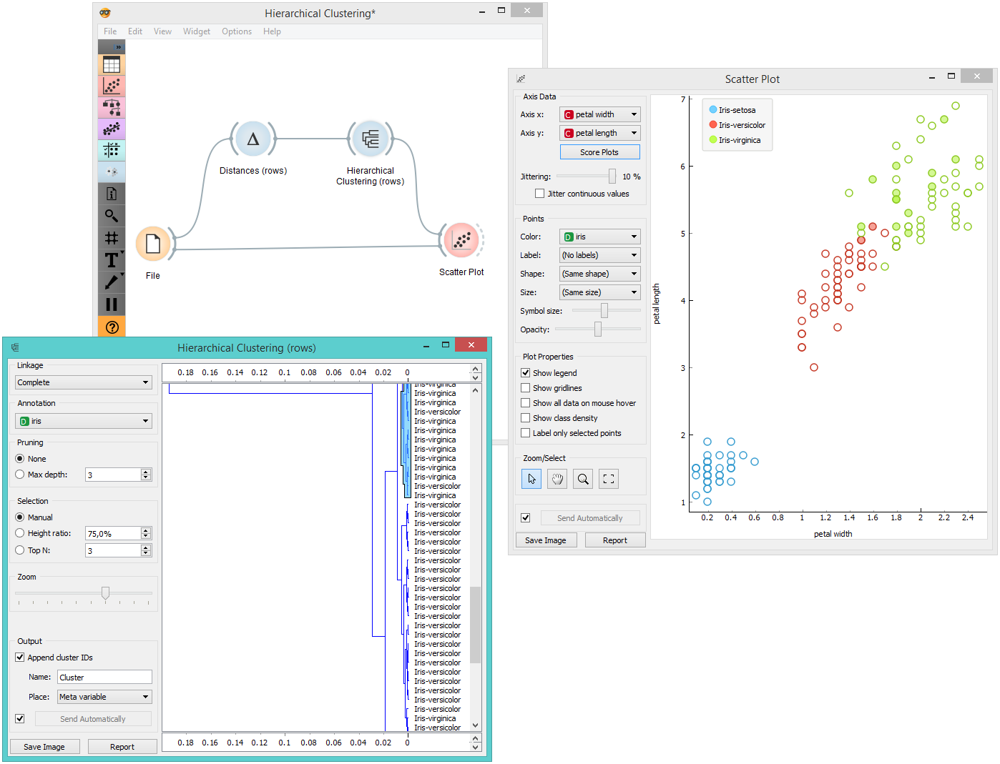

Hierarchical Clustering
=======================

Groups items using a hierarchical clustering algorithm.

**Inputs**

- Distances: distance matrix

**Outputs**

- Selected Data: instances selected from the plot
- Data: data with an additional column showing whether an instance is selected

The widget computes [hierarchical clustering](https://en.wikipedia.org/wiki/Hierarchical_clustering) of arbitrary types of objects from a matrix of distances and shows a corresponding [dendrogram](https://en.wikipedia.org/wiki/Dendrogram).

1. The widget supports four ways of measuring distances between clusters:
   - **Single linkage** computes the distance between the closest elements of the two clusters
   - **Average linkage** computes the average distance between elements of the two clusters
   - **Weighted linkage** uses the [WPGMA](http://research.amnh.org/~siddall/methods/day1.html) method
   - **Complete linkage** computes the distance between the clusters' most distant elements
2. Labels of nodes in the dendrogram can be chosen in the **Annotation** box.
3. Huge dendrograms can be pruned in the *Pruning* box by selecting the maximum depth of the dendrogram. This only affects the display, not the actual clustering.
4. The widget offers three different selection methods:
   - **Manual** (Clicking inside the dendrogram will select a cluster. Multiple clusters can be selected by holding Ctrl/Cmd. Each selected cluster is shown in a different color and is treated as a separate cluster in the output.)
   - **Height ratio** (Clicking on the bottom or top ruler of the dendrogram places a cutoff line in the graph. Items to the right of the line are selected.)
   - **Top N** (Selects the number of top nodes.)
5. Use *Zoom* and scroll to zoom in or out.
6. If the items being clustered are instances, they can be added a cluster index (*Append cluster IDs*). The ID can appear as an ordinary **Attribute**, **Class attribute** or a **Meta attribute**. In the second case, if the data already has a class attribute, the original class is placed among meta attributes.
7. The data can be automatically output on any change (*Auto send is on*) or, if the box isn't ticked, by pushing *Send Data*.
8. Clicking this button produces an image that can be saved.
9. Produce a report.

Examples
--------

The workflow below shows the output of **Hierarchical Clustering** for the *Iris* dataset in [Data Table](../data/datatable.md) widget. We see that if we choose *Append cluster IDs* in hierarchical clustering, we can see an additional column in the **Data Table** named *Cluster*. This is a way to check how hierarchical clustering clustered individual instances.

In the second example, we loaded the *Iris* dataset again, but this time we added the [Scatter Plot](../visualize/scatterplot.md), showing all the instances from the [File](../data/file.md) widget, while at the same time receiving the selected instances signal from **Hierarchical Clustering**. This way we can observe the position of the selected cluster(s) in the projection.

