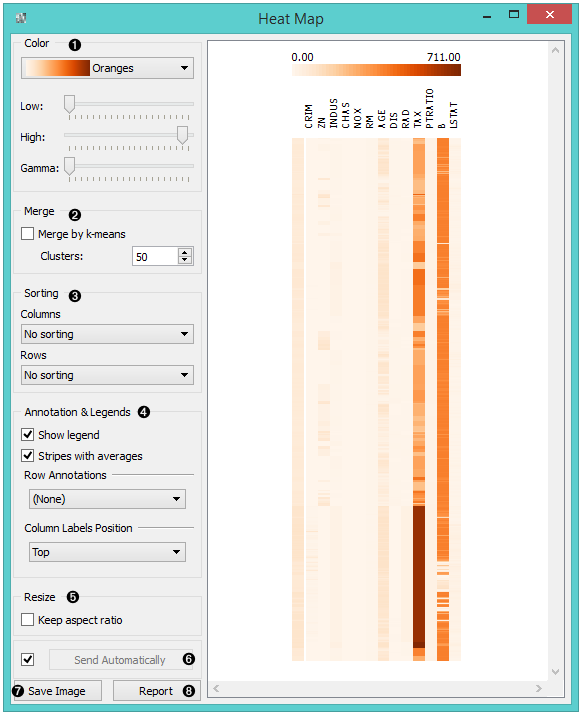
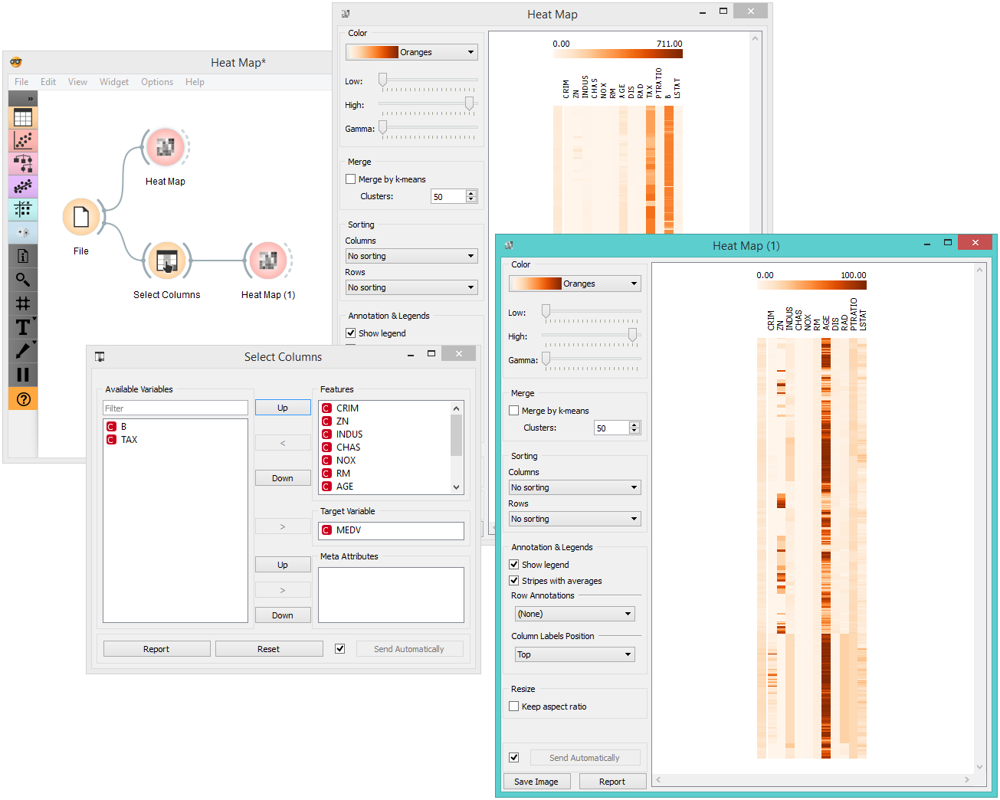

Heat Map
========

Plots a heat map for a pair of attributes.

**Inputs**

- Data: input dataset

**Outputs**

- Selected Data: instances selected from the plot

[Heat map](https://en.wikipedia.org/wiki/Heat_map) is a graphical method for visualizing attribute values by class in a two-way matrix. It only works on datasets containing continuous variables. The values are represented by color: the higher a certain value is, the darker the represented color. By combining class and attributes on x and y axes, we see where the attribute values are the strongest and where the weakest, thus enabling us to find typical features (discrete) or value range (continuous) for each class.

1. The color scheme legend. **Low** and **High** are thresholds for the color palette (low for attributes with low values and high for attributes with high values). Selecting one of diverging palettes, which have two extreme colors and a neutral (black or white) color at the midpoint, enables an option to set a meaningful mid-point value (default is 0).
2. Merge data.
3. Sort columns and rows:
   - **No Sorting** (lists attributes as found in the dataset)
   - **Clustering** (clusters data by similarity)
   - **Clustering with ordered leaves** (maximizes the sum of similarities of adjacent elements)
4. Set what is displayed in the plot in **Annotation & Legend**.
   - If *Show legend* is ticked, a color chart will be displayed above the map.
   - If *Stripes with averages* is ticked, a new line with attribute averages will be displayed on the left.
   - **Row Annotations** adds annotations to each instance on the right.
   - **Column Label Positions** places column labels in a selected place (None, Top, Bottom, Top and Bottom).
5. If *Keep aspect ratio* is ticked, each value will be displayed with a square (proportionate to the map).
6. If *Send Automatically* is ticked, changes are communicated automatically. Alternatively, click *Send*.
7. *Save image* saves the image to your computer in a .svg or .png format.
8. Produce a report.

Example
-------

The **Heat Map** below displays attribute values for the *Housing* dataset. The aforementioned dataset concerns the housing values in the suburbs of Boston.

The first thing we see in the map are the 'B' and 'Tax' attributes, which are the only two colored in dark orange. The 'B' attribute provides information on the proportion of blacks by town and the 'Tax' attribute informs us about the full-value property-tax rate per $10,000. In order to get a clearer heat map, we then use the [Select Columns](../data/selectcolumns.md) widget and remove the two attributes from the dataset. Then we again feed the data to the **Heat map**. The new projection offers additional information.

By removing 'B' and 'Tax', we can see other deciding factors, namely 'Age' and 'ZN'. The ‘Age’ attribute provides information on the proportion of owner-occupied units built prior to 1940 and the 'ZN' attribute informs us about the proportion of non-retail business acres per town.

The **Heat Map** widget is a nice tool for discovering relevant features in the data.  By removing some of the more pronounced features, we came across new information, which was hiding in the background.

References
----------

[Housing Dataset](https://archive.ics.uci.edu/ml/datasets/Housing)
