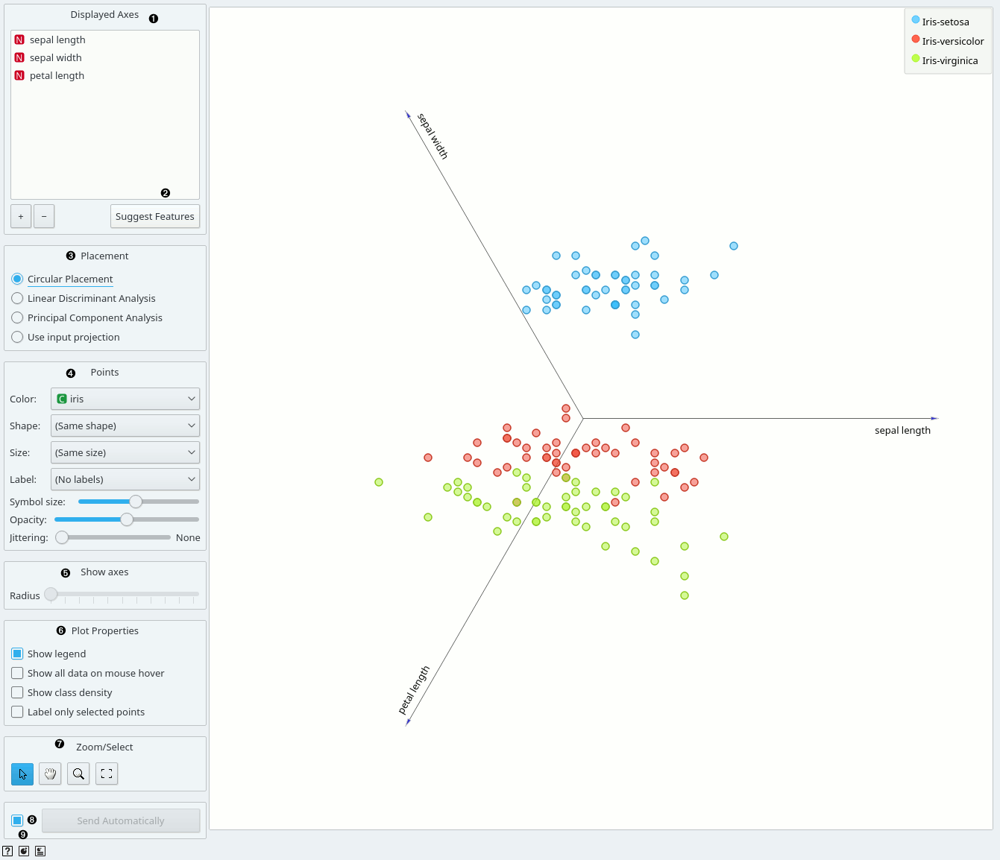
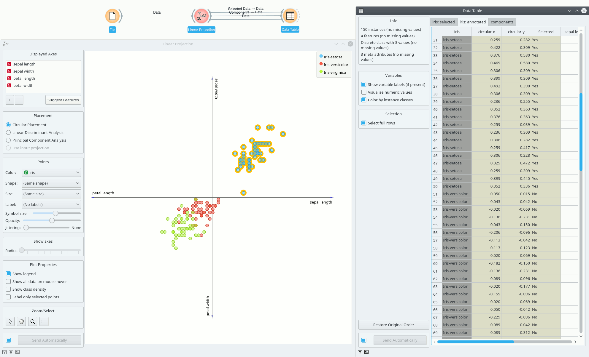

Linear Projection
=================

A linear projection method with explorative data analysis.

**Inputs**

- Data: input dataset
- Data Subset: subset of instances
- Projection: custom projection vectors

**Outputs**

- Selected Data: instances selected from the plot
- Data: data with an additional column showing whether a point is selected
- Components: projection vectors

This widget displays [linear projections](https://en.wikipedia.org/wiki/Projection_(linear_algebra)) of class-labeled data. It supports various types of projections such as circular, [linear discriminant analysis](https://en.wikipedia.org/wiki/Linear_discriminant_analysis), [principal component analysis](https://en.wikipedia.org/wiki/Principal_component_analysis), and custom projection.

Consider, for a start, a projection of the *Iris* dataset shown below. Notice that it is the sepal width and sepal length that already separate *Iris setosa* from the other two, while the petal length is the attribute best separating *Iris versicolor* from *Iris virginica*.

1. Axes in the projection that are displayed and other available axes.
2. Optimize your projection by using **Suggest Features**. This feature scores attributes by average classification accuracy and returns the top scoring attributes with a simultaneous visualization update.
3. Choose the type of projection.
4. Axes inside a circle are hidden. Circle radius can be be changed using a slider.
5. Adjust *plot properties*:
   - Set [jittering](https://en.wikipedia.org/wiki/Jitter) to prevent the dots from overlapping (especially for discrete attributes).
   - *Show legend* displays a legend on the right. Click and drag the legend to move it.
   - *Show class density* colors the graph by class (see the screenshot below).
   - *Label only selected points* allows you to select individual data instances and label them.
6. *Select, zoom, pan* and *zoom to fit* are the options for exploring the graph. Manual selection of data instances works as an angular/square selection tool. Double click to move the projection. Scroll in or out for zoom.
7. If *Send automatically* is ticked, changes are communicated automatically. Alternatively, press *Send*.
8. *Save Image* saves the created image to your computer in a .svg or .png format. Produce a report.

Example
-------

The **Linear Projection** widget works just like other visualization widgets. Below, we connected it to the [File](../data/file.md) widget to see the set projected on a 2-D plane. Then we selected the data for further analysis and connected it to the [Data Table](../data/datatable.md) widget to see the details of the selected subset.

References
----------

Koren Y., Carmel L. (2003). Visualization of labeled data using linear transformations. In Proceedings of IEEE Information Visualization 2003, (InfoVis'03). Available [here](http://citeseerx.ist.psu.edu/viewdoc/download;jsessionid=3DDF0DB68D8AB9949820A19B0344C1F3?doi=10.1.1.13.8657&rep=rep1&type=pdf).

Boulesteix A.-L., Strimmer K. (2006). Partial least squares: a versatile tool for the analysis of high-dimensional genomic data. Briefings in Bioinformatics, 8(1), 32-44. Abstract [here](http://bib.oxfordjournals.org/content/8/1/32.abstract).
