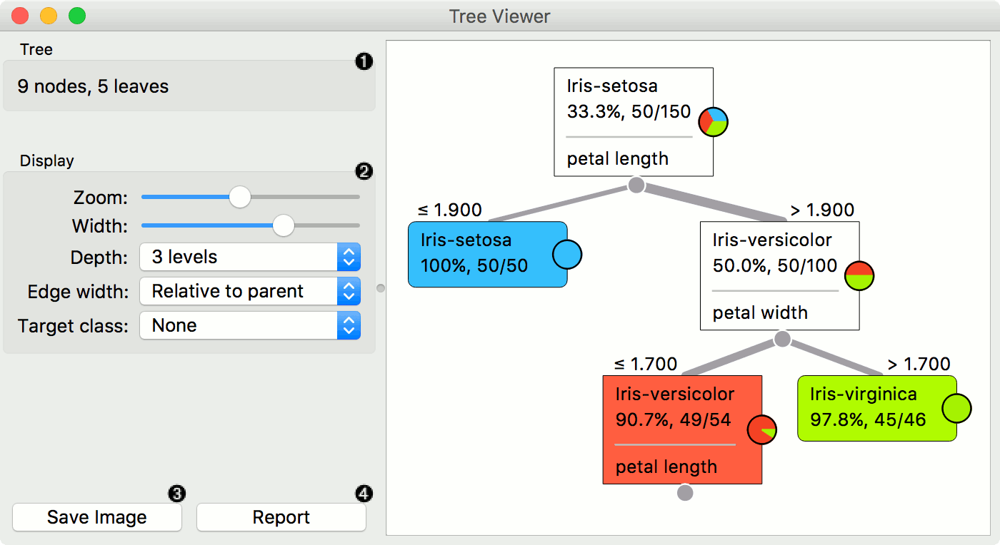
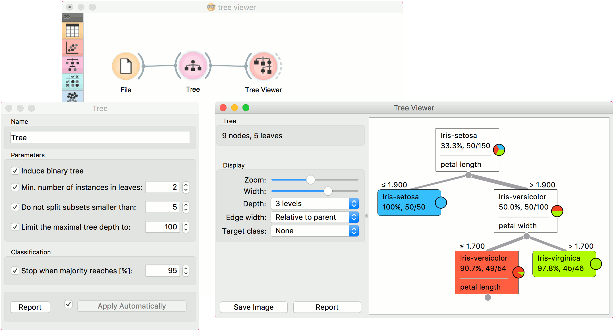
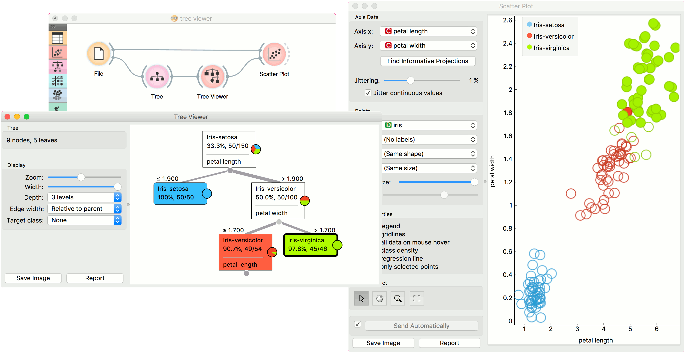
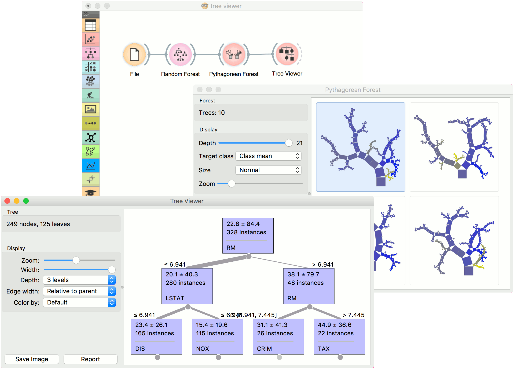

Tree Viewer
===========

A visualization of classification and regression trees.

**Inputs**

- Tree: decision tree

**Outputs**

- Selected Data: instances selected from the tree node
- Data: data with an additional column showing whether a point is selected

This is a versatile widget with 2-D visualization of [classification and regression trees](https://en.wikipedia.org/wiki/Decision_tree_learning). The user can select a node, instructing the widget to output the data associated with the node, thus enabling explorative data analysis.

1. Information on the input.
2. Display options:
   - Zoom in and zoom out
   - Select the tree width. The nodes display information bubbles when hovering over them.
   - Select the depth of your tree.
   - Select edge width. The edges between the nodes in the tree graph are drawn based on the selected edge width.
      - All the edges will be of equal width if *Fixed* is chosen.
      - When *Relative to root* is selected, the width of the edge will
         correspond to the proportion of instances in the corresponding
         node with respect to all the instances in the training data. Under
         this selection, the edge will get thinner and thinner when
         traversing toward the bottom of the tree.
      - *Relative to parent* makes the edge width correspond to the proportion
         of instances in the nodes with respect to the instances in their
         parent node.
   - Define the target class, which you can change based on classes in the data.
3. Press *Save image* to save the created tree graph to your computer as a *.svg* or *.png* file.
4. Produce a report.

Examples
--------

Below, is a simple classification schema, where we have read the data, constructed the decision tree and viewed it in our **Tree Viewer**. If both the viewer and [Tree](../model/tree.md) are open, any re-run of the tree induction algorithm will immediately affect the visualization. You can thus use this combination to explore how the parameters of the induction algorithm influence the structure of the resulting tree.

Clicking on any node will output the related data instances. This is explored in the schema below that shows the subset in the data table and in the [Scatter Plot](../visualize/scatterplot.md). Make sure that the tree data is passed as a data subset; this can be done by connecting the **Scatter Plot** to the [File](../data/file.md) widget first, and connecting it to the **Tree Viewer** widget next. Selected data will be displayed as bold dots.

**Tree Viewer** can also export labeled data. Connect [Data Table](../data/datatable.md) to **Tree Viewer** and set the link between widgets to *Data* instead of *Selected Data*. This will send the entire data to **Data Table** with an additional meta column labeling selected data instances (*Yes* for selected and *No* for the remaining).

Finally, **Tree Viewer** can be used also for visualizing regression trees. Connect [Random Forest](../model/randomforest.md) to [File](../data/file.md) widget using *housing.tab* dataset. Then connect [Pythagorean Forest](../visualize/pythagoreanforest.md) to **Random Forest**. In **Pythagorean Forest** select a regression tree you wish to further analyze and pass it to the **Tree Viewer**. The widget will display the constructed tree. For visualizing larger trees, especially for regression, [Pythagorean Tree](../visualize/pythagoreantree.md) could be a better option.

